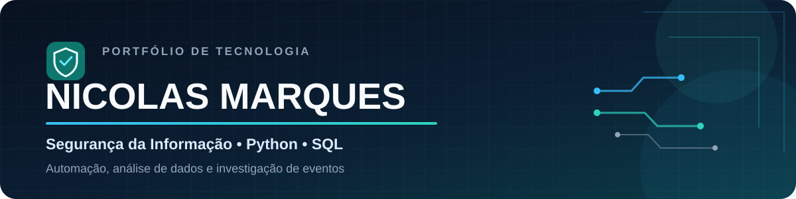

 

## Sobre mim

Atuo na área de **Gestão de Terceiros** e curso **Segurança da Informação**, reunindo experiência com processos, fornecedores e riscos a estudos práticos em tecnologia.

Desenvolvo projetos com **Python, SQL e análise de dados** para automatizar tarefas, organizar informações e investigar eventos de segurança. Meu portfólio apresenta aplicações documentadas, dados fictícios, tratamento de erros e testes automatizados.

> **Foco de desenvolvimento:** conectar processos, dados, riscos e tecnologia em soluções claras, testáveis e úteis.

## Visão rápida

| Foco | Evidências no portfólio |
|---|---|
| 🤝 Processos e riscos | Experiência profissional em Gestão de Terceiros e acompanhamento de fornecedores |
| 🔐 Segurança e análise de eventos | Detecção de tentativas de força bruta por IP e intervalo de tempo |
| 🐍 Automação com Python | Segmentação por fornecedor, relatórios em Excel, JSON e rascunhos no Outlook |
| 🧪 Qualidade de software | Projetos validados com testes automatizados e casos de erro |
| 🗄️ Dados e SQL | Modelagem relacional de usuários, eventos e incidentes de segurança |

## Projetos em destaque

<table>
  <tr>
    <td width="50%" valign="top">
      <h3>📨 Automação de Follow-up 365</h3>
      
Gera rascunhos personalizados no Outlook a partir de pedidos pendentes, com tabela HTML e anexos separados por fornecedor.

      
<b>Demonstra:</b> automação de processos, segmentação de dados, HTML, JSON e integração com Outlook.

      
<code>Python</code> <code>Outlook</code> <code>JSON</code> <code>Automação</code>

      
    </td>
    <td width="50%" valign="top">
      <h3>📊 Automação de FUP por Fornecedor</h3>
      
Segmenta pendências por fornecedor e unidade, gera relatórios individuais em Excel e prepara mensagens no Outlook.

      
<b>Demonstra:</b> tratamento de planilhas, regras de negócio, automação de e-mails e proteção de dados.

      
<code>Python</code> <code>Excel</code> <code>OpenPyXL</code> <code>Outlook</code>

      
    </td>
  </tr>
  <tr>
    <td width="50%" valign="top">
      <h3>🔐 Analisador de Logs de Segurança</h3>
      
Analisa logs de autenticação, agrupa falhas por IP e detecta possíveis ataques de força bruta dentro de uma janela de tempo.

      
<b>Demonstra:</b> parsing de arquivos, datas e intervalos, dicionários, validação de entradas e testes automatizados.

      
<code>Python</code> <code>Datetime</code> <code>Unittest</code> <code>Cybersecurity</code>

      
    </td>
    <td width="50%" valign="top">
      <h3>🗄️ Banco de Incidentes de Segurança</h3>
      
Banco relacional em SQLite para investigar eventos de autenticação e organizar incidentes, com cinco tabelas, dados fictícios e consultas analíticas.

      
<b>Demonstra:</b> modelagem relacional, chaves, relacionamento muitos-para-muitos, JOIN, GROUP BY, HAVING e CASE.

      
<code>SQL</code> <code>SQLite</code> <code>Cybersecurity</code> <code>Análise de dados</code>

      
    </td>
  </tr>
  <tr>
    <td width="50%" valign="top">
      <h3>✅ Gerenciador de Tarefas em Python</h3>
      
Aplicação de terminal para criar, listar, concluir e remover tarefas, mantendo os dados em JSON.

      
<b>Demonstra:</b> orientação a objetos, persistência, tratamento de erros e quatro testes automatizados.

      
<code>Python</code> <code>JSON</code> <code>POO</code> <code>Unittest</code>

      
    </td>
    <td width="50%" valign="top">
      <h3>📚 Laboratório de Estudos</h3>
      
Exercícios e anotações que documentam minha evolução prática em Python e SQL.

      
<b>Demonstra:</b> fundamentos, estruturas de dados, orientação a objetos, arquivos e consultas SQL.

      
<code>Python</code> <code>SQL</code> <code>Aprendizado contínuo</code>

      
    </td>
  </tr>
</table>

## Tecnologias aplicadas nos projetos

  
  &nbsp;
  
  &nbsp;
  
  &nbsp;
  

## Conhecimentos em desenvolvimento

  
  &nbsp;
  

 

## Formação e certificações

- **Python** · Santander Open Academy — fundamentos aplicados aos projetos do portfólio.
- **Big Data & Analytics** · FIAP — 60 horas.
- **Inteligência Artificial e Computacional** · FIAP — 80 horas.
- **Introdução ao Microsoft Azure Data (DP-900)** — 8 horas.
- **Introdução à Infraestrutura de Nuvem (AZ-900)** — 8 horas.

  

---

  <b>Construindo e documentando projetos que conectam processos, dados, automação e Segurança da Informação.</b>
    
  
  

